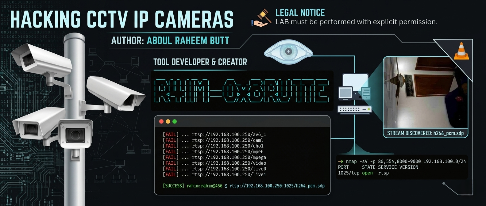

  <!-- MAIN BANNER IMAGE -->
  

## Overview

This project demonstrates a controlled cybersecurity assessment of RTSP-enabled IP camera services.

The lab focuses on:

- Service Discovery
- RTSP Enumeration
- Authentication Security Testing
- Stream Path Discovery
- Security Validation
- Professional Documentation

## Technologies

- Kali Linux
- Nmap
- Python
- VLC Media Player

## Learning Outcomes

- Network Enumeration
- Protocol Analysis
- Security Assessment Methodology
- Vulnerability Identification
- Technical Reporting

## Legal Notice

This project was conducted in a controlled lab environment on systems owned by or authorized for testing by the researcher.

Author: Abdul Raheem Butt
